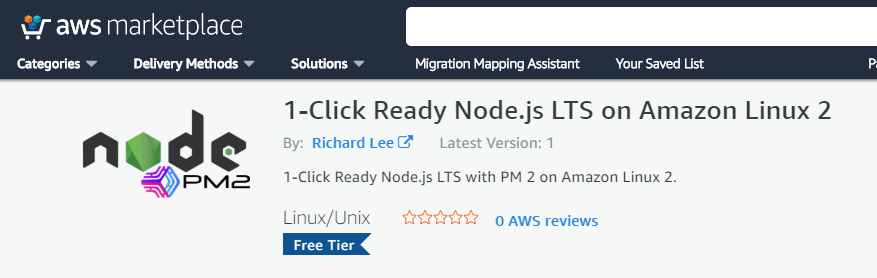
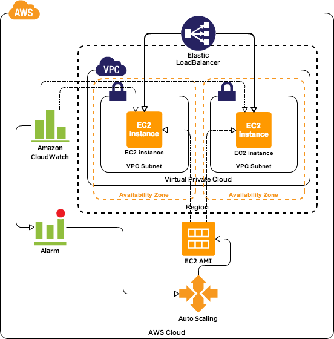
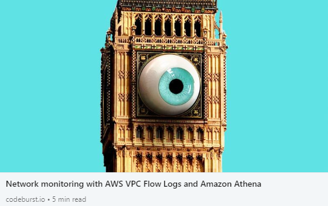

# SimpleUsersAPI.NodeJS.Express
A zero to master API made in Node.js, Express, MongoDb, and AWS.

## Agenda
- [x] Simple CRUD operations for Users REST API using Express and Mongoose
- [x] Secure the API (Authentication and Authorization concerns)
- [X] Research and apply good practices on top of a NodeJS Express API 
- [x] ~~Apply some resilience layer on top of database connection (maybe using some sort of circuit breaker)~~*¹
- [ ] (Optional) Create a UI for the API before the migration to AWS to test some integrations in a real-world scenario, (eg. CORS, Firebase Authentication)
- [X] Migrate the MongoDB workload to AWS, setting up a Multi AZ infrastructure to provide High Availability
- [x] Configure an OpenAPI Specification work environment
- [x] Migrate the Users' microservice to AWS in smalls Linux Machines
- [x] Configure Continuous Deployment with AWS CodeDeploy
- [x] Set up a Fault Tolerant environment for the API, by using at least 3 AZ in a Region/VPC (ELB)  
- [x] Integrate CodeDeploy Blue/Green Deployment with Auto-Scaling and Application Load Balancer
- [x] Set up Observability in the application at general, using AWS X-Ray, CloudTrail, VPC Flow Logs, and (maybe) ELK Stack.
- [ ] Provide infrastructure as a service by creating a CloudFormation Stack of all the stuffs
- [ ] ~~Configure a CI/CD with Blue/Green Deployment (use Route 53 weighted routing policy) (AWS or Team City?)~~ 
- [ ] Add a Cache layer with Redis (Write-Through or Lazy Loading strategy) - maybe before publish the API in AWS
- [ ] Containerize the Users API microservice with Docker and update all AWS environment (using AWS Fargate) or by using ECS
- [ ] Create a sample of how all of it can be done with Serverless in AWS with API Gateway, Lambda, DynamoDb?

### Simple CRUD operations for Users REST API using Express and Mongoose - *v1.0.1*

At this point we have a simple REST API with basic settings and CRUD operations using Mongo running in Docker.

A lot of improvement needs to be done yet, we've some security vulnerabilities (eg. CSRF, CORS), some code layer separations that can be done to avoid code duplication in case of application growth (eg. code in userController) and even we can still provide a better architectural organization and separation to reach a ready-to-production stage. 
> We will leverage microservices' concerns later on.

We need to improve our REST implementation as well, to reach the level 3 of Richardson Maturity Model (RMM), and implement some OpenAPI specification in some way (eg. swagger docs).     
 
**Instructions:** 
- Execute `docker-compose up -d` at root level to run `mongo` and `mongo-express` services.
- Then you can hit `http://localhost:8081` in your browser to all mongodb management tasks needed for this project.
- Run the app with `npm start` =P
> Note: There is a postman collection (with all used endpoint) at root level tha can be imported. 

### Secure the API (Authentication and Authorization concerns) - *v2.0.0*

We have a common user authentication flow leveraging JWT implementation, may be used for the production stage of small apps.
Apply some resilience layer on top of database
User management and authentication tasks usually comes with lots of undesirables time-efforts, and complexities, so, doesn't worth waste so much time on a sample of implementation of it, it's always a good idea we consider an "Authentication as a Service" Providers like Auth0, Firebase, AWS Cognito and read their docs, this way we can focus on our business goals.
> But a solid understanding of OAuth2 and OpenID specification will be so helpful in your life...
 
**Instructions:**

All instructions of section 1 are applied here, plus you may import the postman collection again 'cause it was updated with the new `register` and `login` endpoints.
- You need to call the `register`, and then `login` and take the `token` response and use it as `Authorization: JWT <token>` HTTP header for all the endpoints that are all secured now.

### Research and apply good practices on top of a NodeJS Express API - *v3..*

How it is a huge topic, I split it up to some releases.

#### Asynchronous methods and REST - *v3.0.0*

How Node.js is a single threaded framework that works on top of the delegation of tasks to the `Event Loop` 
we need to take care about our synchronous operations (eg. API, Database Calls) to avoid blocking of our app, 
so weed to leverage asynchronous methods as soon as possible. 
Therefore we're invoking all `Mongoose`, and `bcrypt` methods async available now 
and handling properly the application errors either sync or async through a `handle` middleware.  

We still need to work in a Cluster way and forking process, leveraging the number of cores available to us _(we'll do it later using PM2)_

We can consider this API now REST level 2 of RMM, we are properly representing resources and working with HTTP Status Codes, so at this point, we've a solid API that can work fine inside an organization, 
**but** if your goal is to build a public API we need to think about a way to make our API self-documenting and provides a solid response format across the entire API, 
and is exactly at this points that the level 3 of RMM solves our problems, introducing the concept of `Hypermedia` and `Mime Types`.

We need to work with an OpenApi spec and still talking about REST APIs, providing a cache response layer too.

> Note: The API has versioning now.

**Instructions:**

Just a note here, you'll need to import the updated POSTMAN collection again. 

#### Security Aspects and better general project organization - *v3.1.1*

Important security aspects to handle attacks as _Cross Site Request Forgery (CSRF)_, and _CORS_ settings are Ok now. 
> We need to go back here when a UI will have to integrate with this API
>
Some common performance settings as gzip compression were done, but we need to keep in mind that lots of stuff at this field can be (and maybe will) done in the Reverse Proxy later.

The Configuration aspects of the API were reorganized to better readability.

**Instructions:**

For the configurations, this project works which a combination of `dotenv` (using `dotenv-safe`) and `convict`, so, 
the values that should be stored as environment variables (such as keys/secrets/passwords) you may notice at `.env.example` file
and the others values that there is no problem to reveal them among other team members can be stored in files like 
`development.json` and `production.json` under the `config`directory. 

#### Clustering in Node.js with PM2 - *v3.2.0*

> Tl;dr: No multi-threading model, however you need to scale your app earlier with Node.js Cluster model, 
>but you don't need to do it on your own, you may use a **Node Process Manager** like `PM 2` instead.     
>
Like I said earlier Node.js is a single-threaded language and works on top on the `Event Loop` model 
and simplifies a lot our development model about multi-threading and race-condition concerns that 
we need to handle in other languages like C# and Java to perform better in our multi-core server machine. 
In Node.js we don't need to worry about this kind of stuff, but on the other hand, we need to be concerned 
about the Node.js Cluster module and how it handles the worker processes, how they are spawned according 
the number of Cores from the host machine, how to fork a new child worker, and so on.    

To help us which this task, we need to use a **Node Process Manager**, the most popular nowadays is the `PM 2`. 
`PM 2` will fork process according to new requests are coming X host server capacity, besides it will 
handle restarts, errors, monitoring, among other tasks.

If we need, `PM 2` will handle some stuffs like deploy in production directly in the server destination host, 
but I prefer to use `PM 2` limited to cluster management responsibilities, one reason is that working with AWS, 
the deployments using EC2 hosts is faster (and well-organized) through "Golden AMI" strategy, this way we've 
the `PM 2` package installed globally and a symlink to it at the project level.

We need to handle database close connection whenever the `PM2` process is killed, 
I'll reorganize the database later in some kind of repository of a hexagonal architecture (maybe Onion architecture).
 
> I'll show off how to work with "Golden AMI" + ASG + Placement Groups + Blue-Green Deployments in AWS later.

> To boost the build time and app initialization  we may install globally all the main packages like `express`, `body-parser`.
>

**Instructions:**

Install `pm2` package globally and create a `npm link` to it in this project.

Notice that `npm start` script will now run `pm2 start ./pm2.config.js` and 
I made a choice to still use `nodemon` for development, so I created a new npm script `dev` for it. 

- All PM2 settings are in the `pm2.config.js` file
- All scripts needed for daily-basis tasks are included in the `package.json` scripts section.

> I'm using the main settings needed for a ready-to-production app.
>

#### Health Check and Graceful Shutdown - *v3.3.0*

- Health Checks - In order to signalize to your Load Balancer that an instance is fine and there is no need to restarts 
by checking whatever you want eg. your Db connections.

- Graceful Shutdown - In order to have a chance to dispose of all your unmanaged resources by Node.js before your app 
is killed eg. Db connections.

#### Final Notes

We're still using `console.log` for logging, but how it's a blocking code, we need to change it to a 
non-blocking library like `Winston` with some kind of correlation requests strategy, 
besides `Winston` has great capabilities to integrate with others APM solutions through the idea of `transports`, 
and `transformations` operations we may ended up redoing some work when integrating our logging strategy 
with our final APM solution and Cloud Provider tools for logging.

AWS offers great solutions for logging, Azure has its own solutions too, and so on. 
Plus, in some cases, we may still need a third-party APM solution like ElasticSearch APM, Dynatrace, Datadog among others.
Therefore we need to keep all of it in mind, before either choice and configure a non-blocking library or 
even start spreading lots of `console.log` in our app.

> I won't do any application architecture decisions here, the better way to do that, is in another repository, focused 
on the architecture itself.

### Apply some resilience layer on top of database connection (maybe using some sort of circuit breaker)

There is no need for us to handle such thing, mongoose take care of it already, you may adjust some advanced options though

### Migrate the MongoDB workload to AWS, setting up a Multi AZ infrastructure to provide High Availability

Prefer moving towards a fully managed service for "ready-to-production" databases, AWS does not offer 
a service like this for MongoDB, and the most popular way to achieve this in AWS today is through **MongoDB Atlas**.

MongoDB Atlas has a free tier, but you should not use it for production workloads at all. 
To attend a reliable and high scalable production workload at general our database infrastructure would need to have at minimum a 
Master and two Slaves hosts all in separated AZ with Multi-AZ failover enabled _(with Read Replicas sometimes)_, plus, 
we would have a significant performance improvement by hitting our database through `VPC Endpoints` (for VPC internal communication), 
instead of going over to the public internet to reach our database.

In order to reach the goal above in MongoDB Atlas we would need to have an `M10 Dedicated Cluster` - that offers 2 GB RAM, 10 GB of storage, 100 IOPs,  running in an isolated VPC with VPC Peering _(and VPC Endpoint)_ enabled.
The estimated price for this 3-node replica set is **57 USD per month**, despite the costs is not the focus of this project, I can't avoid some comparison with others AWS Database as a service solutions.

- **Atlas X AWS DynamoDb** - We can reach much more capacity in terms of Data Storage, Operations per second, and high scalability in DynamoDB, by a much smaller price, but I believe that MongoDB offers better ORMs options like `mongoose` that help us in terms of development effort.
> We may end up using a **Redis** cache layer to avoid hits in our database all the time, it's a very common pattern regardless of our database solution, it will incur in costs and development effort increases. In AWS DynamoDB we can use AWS DAX Accelerator that is a cache layer for DynamoDB and can improve our queries from milliseconds to microseconds without coding changes needed by the half of price of a MongoDB Atlas minimal production settings.

- **Atlas X AWS DocumentDB** - AWS DocumentDB is a MongoDB-compatible fully managed Database-as-a-service product, but the initial costs are so high, that won't worth compare it, it's a product for Big Data solutions. I'm just pointing it here because of the MongoDB compatibilities.  

- **Atlas X Amazon Aurora Serverless** - If you're willing to go with `sequelize` relational ORM, Amazon Aurora is your best option, mainly for early stages projects or MVPs that you don't know your workload yet. You'll have a fully managed and high available database with serverless pricing model, it means in short terms you'll pay for resources that are consumed while your DB is active only, not for underutilized databases hosts provisioned that needs to be up and running all the time. 
Plus, after some evolving of your solution and knowledge of your workload, you can decrease your costs by purchasing Reserved Instances.

- **Atlas X Custom MongoDB cluster** - You may build your Replica Set with minimal effort by using a `CloudFormation` template, AWS offers a good one also you can find great options at the community, including `Terraform` templates, plus you can use a MongoDB Certified by Bitnami AMI as a host instead of a fresh EC2 in these templates. Optionally you can set up an AWS Backup on your EC 2 hosts, and then you may update the `CloudFormation` templates that you've used if it is not already included.
The cons here are that you won't have a fully managed service, of course, but the cluster was configured by one. You can start by using an infrastructure-as-a-code template and later move towards a fully managed product like MongoDB Atlas, though.

> For the sake of simplicity, I'll use MongoDB Atlas free-tier at this project.

### Configure an OpenAPI Specification work environment - *v4.0.0*

A rock-solid API must start by your design, team collaboration, mocking, and approval thereafter we can start the hands-on it.
Engage the team to develop by using that approach is beneficial in so many ways and to enable it I like to use a GUI editor, my preferred is [Apicurio Studio](https://www.apicur.io/) a web-based OpenAPI editor that enables team collaboration and mock of your API.

[Apicurio - How a OpenAPI GUI can help us](public/apicurioide.jpg)
 
Now, we can check and test our API through the link `http://localhost:4000/v1/api-docs/`

### Migrate the Users' microservice to AWS in smalls Linux Machines - *v5.0.0*

Starting from scratch to a master production-ready, high-available, and elastic infrastructure is a journey. Therefore,
I can't go deep on it _I'll go over it in some articles later_, but I'll focus on all pieces that matters
for the purpose of this project, but still, I'll show off all main details that we may come across while setting up 
our application.

#### First things first 

Before thinking about scalability, load-balancing, high-availability, and disaster recovery concerns, we need to have our app up and running
in a single AWS EC2 instance.

Launch your ec2, install everything needed and copy your app to it, thus, ensure your app is up and running.

You may create a _public_ directory at root level with `mkdir -m777 public` to be able to copy files from your machine with `scp` command using 
a non-root user like so `scp -i "MyKeyPair.pem" /path/SampleFile.txt ec2-user@ec2-54-56-251-246.compute-1.amazonaws.com:public/`

> Tip: Prefer using an Amazon Linux 2 AMI to launch your EC2
>> Don't worry so much about Security concerns here, just focus on letting your app in a valid state as soon as possible
>
>> Create a resource role for your EC 2 (later we'll add some policies to it)
> 
>> For this kind of apps I like to use general purpose t3 instance family (`micro`, to be more specific), 
>because it´s cheaper but network-efficient, and burstable.

#### Baked/Golden AMI

Imagine now if you need to recreate your EC2, think about everything you'll need to install and settings up again. Plus, imagine all of it being done whenever a new EC2 is triggered by an Auto Scaling activity _by running tons of scripts in `UserData` section_.
Think about how long it takes to create a new EC2 instance...

The proper way to handle it is by a strategy called **Golden AMI** that consists of a 
prebuilt application stored inside an AMI to save time whenever a new instances needs to be provisioned.

To save your time I've created a Golden AMI for Node.js apps, [1-Click Ready Node.js LTS on Amazon Linux 2](https://aws.amazon.com/marketplace/pp/B08B7NBGN6)
by using this AMI you'll have a "ready-to-production" Node.js server already configured.

##### How should I use it?

How the AMI name suggests, you need just launch your fresh EC 2 from this AMI. You will have an up and running EC 2 with Node.js LTS (stable version) with the PM 2 package installed globally.

#### Golden AMI x npm global packages

You should consider some packages that you're using in your app locally as global packages, think about how you are
using them in another apps, and how your devs/colleagues have those packages installed in theirs machines too.
Take a look at those node.js' packages that we have installed as local packages, but that is constantly installed using the same version and code for each new app that we have created: [npm common packages list](https://www.one-tab.com/page/EWcOARW0TEKlIkBw-UOjIw).

I'm listing `cors`, `bcrypt`, `helmet`, `pm2`, `convict`, and `body-parser`, so you'll notice their packages' releases doesn't occur
weekly, it's more about monthly updates, also, some packages as `helmet` - _a package that handles security concerns in your app_, as soon a breaking changing version has released, you'll probably like to update it in all app across your organization - _asap according to every single app, of course_.
If you're thinking that I'm getting crazy, just notice that `pm2` is usually installed as global _(check their docs and google it)_, so
packages like `convict`, `cors`, or even `helmet` can't be really shared across our apps in the same way as `pm2` does?

**That is a polemic thread, there are pros and cons here**, I'm just point it out as something to be considered, personally 
I like to have `pm2`, and `helmet` _for **security/compliance** reasons_ as global and the others as local.

> **TL;DR:** You may have **cost savings** by moving some of your local packages as global because you'll decrease the overall deployment time of your app, 
>this way you can update the ASG `scale out` policy to be executed whenever it reaches 85% of `CPU Utilization`, instead of 70% as an example.

### Configure Continuous Deployment with AWS CodeDeploy - *v6.0.0*

Once you have your Node.js app running from a Golden AMI I recommend setting up your continuous deployment 
via CodeDeploy and after your Single Instance with CodeDeploy is working properly 
move to the next topic in your infrastructure settings, Auto-Scaling + ELB.
> Note: You'll need to go back to CodeDeploy later to configure your Blue-Green Deployment over ASG.

AWS CodeDeploy is a powerful service for automating deployments to Amazon EC2, AWS Lambda, and on-premises servers. However, it can take some effort to get complex deployments up and running or to identify the error in your application when something goes wrong.

**The proper way to deal with CodeDeploy is by testing and debugging it locally and once everything working properly fire your deployment process in AWS CodeDeploy.**

However, to have a CodeDeploy environment up and running locally is not so trivial, at least until now! :beers:

 I've created a docker image with an `AmazonLinux 2` instance on it along with the `CodeDeploy Agent` _(and other stuff)_, 
all instructions needed can be cheked at: [richardsilveira/amazonlinux2-codedeploy](https://hub.docker.com/repository/docker/richardsilveira/amazonlinux2-codedeploy)
*Note: Follow the instructions that I've prepared there and take a deeper look at my `appspec.yml` and the `scripts` files in this repository.*

#### Points to note

I'll show off some detailed points that are not so easy to find out, and which you may be would come across along your CodeDeploy environment settings journey. 

##### IAM / Roles

You'll need to attach a `Service Role` in your Deployment Group, and to integrate it with your Auto-Scaling Group environment you'll need to create one can be named *CodeDeployServiceRole*
and attach to it the policies managed by AWS `AWSCodeDeployRole`, `AutoScalingFullAccess` plus a custom policy like this on my gist: [CodeDeployAdditionalPermissionsForEC2ASG](https://gist.github.com/RichardSilveira/0a5ba06fb3e5427cf2ce2254fe33251f).

##### Tagging

Tag your EC2 instances properly will help you in so many aspects, about CodeDeploy I always try to have two Deployment Groups for a single Application
like so: _ProductionInstances-SingleMachine_ / _ProductionInstances_ and tagging my instances 
help my here by letting CodeDeploy identify them by theirs tags.

##### Discussion - CodeDeploy agent installation in UserData Scripts X Golden AMI

You can install the CodeDeploy agent either as part of your Golden AMI or by User Data Scripts. 
AWS doesn't recommend the installation as part of your Golden AMI because you'll need to update the Agent manually, 
and you may face some issues at some point _(when you'll find out a need to update the agent)_, although, you'll have a considerable time 
reduction at the deployment time, thus, it is not a so bad practice.
> See more about it on **_Ordering execution of launch script_** section at AWS docs [Under the Hood: AWS CodeDeploy and Auto Scaling Integration](https://aws.amazon.com/blogs/devops/under-the-hood-aws-codedeploy-and-auto-scaling-integration/)

**Install script:** [EC2 User Data to Install the Code Deploy Agent](https://gist.github.com/RichardSilveira/376d863bb3e87fbf3b901eafb2a89898)

#### Set up a Fault Tolerant environment for the API, by using at least 3 AZ in a Region/VPC (ELB) - *v7.0.0*

We'll build an elastic and high available environment in AWS like in the image bellow, but instead of two AZ, try to work with 3 AZ at minimum always, it's a common approach/best practice strategy for many scenarios about infrastructure scaling.  

How I don't want you bored I'll move fast through the key points of ASG + ELB at sequence.
> I'll take notes only at properties that either you may face issues or I in cases that I feel a needs to share some personal experience.

##### ELB - Target Groups

- You can go with the almost defaults settings. Also, you'll need to use `/healthcheck` for the `Health check path`
 and override the `Port` to use `3000` instead of the default `80` accordingly what was made in _Health Check and Graceful Shutdown_ section)

##### Create Load Balancer

- Go with an Application Load Balancer with port 80 as your Listener

- Select at least three Availability Zones for your Load Balancer, plus, you must use them in your Auto Scaling later on.

- In your Security Group settings, enable Port `80` and `3000` (the healthcheck server) from the internet _(0.0.0.0/0 and ::/0 ipv4 and ipv6 CIDRs)_ in `Inbound rules`.

- Update the `Inbound rules` of the Security Group associated with your EC2 to allows ONLY HTTP traffic (port 80) coming from this Security Group you're using in ELB. 

- You may enable AWS WAF (Web Aapplication Firewall) to protect your website from common attack techniques like SQL injection and Cross-Site Scripting (XSS)

- You may enable AWS Config for compliance (you can define rules about AWS resource configurations and AWS Config will helps you to evaluate and take actions about it)

##### ASG - Launch Templates

- In order to be happy you must reference a Golden AMI for Node.js apps that I've created and gives me a review, [1-Click Ready Node.js LTS on Amazon Linux 2](https://aws.amazon.com/marketplace/pp/B08B7NBGN6).
By using this AMI you'll have a "ready-to-production" Node.js server already configured. 

- You must select the Security Group you've created for the EC 2 _(not that one for ALB)_

- Tag your instances properly here _(I like to use `Name` and `Stage` tags)_.

- Select a **Placement Group since beginning of your project**, for Startups and small project at early stages is common to use the `Spread` Placement Group, 
for large apps, `Partition`, and `Cluster` strategy for Big Data/Machine Learning batch processes because of low network latency and high network throughput.
> It's a summarized and opinionated point of view, I recommend a deep view of Placement Groups and how they work.

- In order to **integrate your ASG with CodeDeploy**, you need to install the CodeDeploy agent, 
therefore, at `User data` section use the script as follows: [EC2 User Data to Install the Code Deploy Agent](https://gist.github.com/RichardSilveira/376d863bb3e87fbf3b901eafb2a89898)

##### Create Auto Scaling Group

- Select the same AZ that you have selected in ALB settings.

- For `Healh Check Type` select `ELB`.

- Create a Scale-out and a Scale-in policy, to add and remove instances accordingly some CloudWatch threshold, e.g. CPU 
_(for memory you'll need to install the Cloudwatch Agent)_
> Pay attention at the cooldown period for your Scale-in policy, usually this time should be lower than that for scale-out policy to help you reduce costs significantly.

- You can create a Scheduled scaling policy for predictable load changes, e.g. if your app has a traffic spike every day 
at lunch-time, its a good idea to scale out some extra machines to handle the incoming load properly. 

- Create a notification for launch/terminate, and fail activities sounds professional, but to do so, you'll need to create a Lambda Function to be subscribed to it, plus, coding this function to notify someone via Slack, Telegram, or other channels.

#### Integrate CodeDeploy Blue/Green Deployment with Auto-Scaling and Application Load Balancer - *v8.0.0*

You've already done the hard work at "Configure Continuous Deployment with AWS CodeDeploy" section _(at least you've read about it)_,
now you'll just update some settings in order to deploy your application through a "Blue/Green" deployment strategy.

> Don't forget to test your deployment local with Docker with: [richardsilveira/amazonlinux2-codedeploy](https://hub.docker.com/repository/docker/richardsilveira/amazonlinux2-codedeploy) 

##### Blue/Green deployment explained

Replaces the instances in the deployment group with new instances and deploys the latest application revision to them. After instances in the replacement environment are registered with a load balancer, instances from the original environment are deregistered and can be terminated. _-by AWS_. 
  
##### About the settings

I'll show off quickly common settings for production apps.

- Deployment type: `Blue/green`
- Environment configuration: `Automatically copy Amazon EC2 Auto Scaling group`
- Traffic rerouting: `Reroute traffic immediately`
- Terminate the original instances in the deployment group: `1 hour`.
- Deployment configuration: `CodeDeployDefault.OneAtTime`
- Load balancer: Enable and select your ALB and its Target Group
- Rollbacks: `Roll back when a deployment fails`

#### Set up Observability in the application at general, using AWS X-Ray, CloudTrail, VPC Flow Logs, and (maybe) ELK Stack - *v9.0.0*

##### Observability and AWS X-Ray
**Observability** is a term related with logging, tracing, and analysis of microservices inter-communication 
and user requests interactions with your application.
In order to promote observability across your microservices, the better strategy nowadays in by the adoption 
of an APM tool such as AWS X-Ray, Elastic APM, Dynatrace, and DataDog. An APM tool provides an easy way to instrument
your app by offering an easy-to-use SDK.
> Instrumentation means the measure of product’s performance, diagnose errors, and to write trace information.

> Instead of coding here, it sounds a better idea have a dedicated repository about AWS X-Ray and other about Elasticsearch

##### AWS CloudTrail
You need to trace and audit not only your application' user interactions, but everything that is changed in your AWS account.
To accomplish it, **AWS CloudTrail** should be your first choice. CloudTrail offers:
* Internal monitoring of API calls being made
* Audit changes to AWS Resources by your users
* Visibility into user and resource activity

AWS CloudTrail is enabled by default and you can either create a new trail or check for recent events that happened in your AWS account.

##### Network monitoring and VPC Flow Logs

**VPC Flow Logs** is an AWS service that enables you to do network monitoring. Build a network-monitored environment in AWS
is a must-have activity about security and compliance of your infrastructure, also, at same time is a huge topic.
I have wrote an article about it - *published by the huge codeburst.io medium editors* - [Network monitoring with AWS VPC Flow Logs and Amazon Athena](https://codeburst.io/network-monitoring-with-aws-vpc-flow-logs-and-amazon-athena-de94969f4175).

At this article you'll learn how to have a monitored network environment in your VPC in a professional way.

You will learn how to use and integrate AWS VPC Flow Logs, Amazon Athena, Amazon CloudWatch, and S3 to help us with analyzing networking traffic tasks, plus, to get notified for threats.

